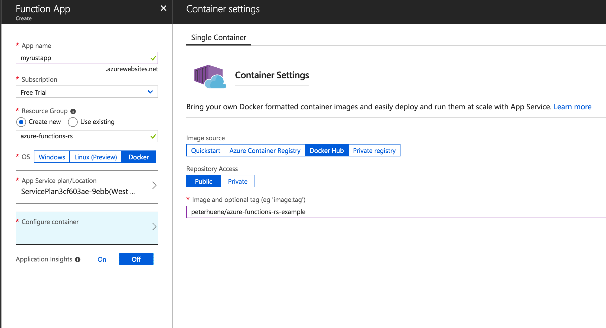

# Azure Functions for Rust

[](https://crates.io/crates/azure-functions)
[](https://docs.rs/azure-functions)
[](https://circleci.com/gh/peterhuene/azure-functions-rs/tree/master)
[](https://github.com/peterhuene/azure-functions-rs/blob/master/LICENSE)

This is an early-stage prototype for implementing [Azure Functions](https://azure.microsoft.com/en-us/services/functions/)
in [Rust](https://www.rust-lang.org/en-US/).

## Disclaimer

Although the maintainer of this project is a Microsoft employee, this project is not an officially recognized Microsoft product and is not an endorsement of any future product offering from Microsoft.

_Microsoft and Azure are registered trademarks of Microsoft Corporation._

## Example

A simple HTTP-triggered Azure Function:

```rust
use azure_functions::bindings::{HttpRequest, HttpResponse};
use azure_functions::func;

#[func]
#[binding(name = "req", auth_level = "anonymous")]
pub fn greet(req: &HttpRequest) -> HttpResponse {
    // Log the message with the Azure Functions Host
    info!("Request: {:?}", req);

    format!(
        "Hello from Rust, {}!\n",
        req.query_params().get("name").map_or("stranger", |x| x)
    ).into()
}
```

See the [examples](https://github.com/peterhuene/azure-functions-rs/tree/master/examples) directory for the complete list of examples.

# Documentation

Documentation for the [latest published version](https://docs.rs/azure-functions).

# Azure Functions Bindings

Azure Functions supports a [wide variety of input and output bindings](https://docs.microsoft.com/en-us/azure/azure-functions/functions-triggers-bindings) that can be used by a function.

In a language like C#, parameters can be annotated with attributes describing how the parameters are bound.

Rust does not support attributes on parameters, so the `#[binding]` attribute is applied on the function with a name that matches the parameter's identifier.  The arguments to the attribute depend on the binding type.

The `#[func]` attribute is used to turn an ordinary Rust function into an Azure Function.  It works by examining the parameters and return type to the function and automatically mapping them to corresponding bindings.

The current list of supported bindings:

| Rust Type                                 | Azure Functions Binding | Direction      |
|-------------------------------------------|-------------------------|----------------|
| `azure_functions::bindings::Blob`         | Input and Ouput Blob    | in, inout, out |
| `azure_functions::bindings::BlobTrigger`  | Blob Trigger            | in, inout      |
| `azure_functions::bindings::HttpRequest`  | HTTP Trigger            | in             |
| `azure_functions::bindings::HttpResponse` | Output HTTP Response    | out            |
| `azure_functions::bindings::QueueTrigger` | Queue Trigger           | in             |
| `azure_functions::bindings::QueueMessage` | Output Queue Message    | out            |
| `azure_functions::bindings::TimerInfo`    | Timer Trigger           | in             |
| `azure_functions::Context`*               | Invocation Context      | n/a            |

\****Note: the `Context` binding is not an Azure Functions binding; it is used to pass information about the function being invoked.***

More bindings will be implemented in the future, including support for retreiving data from custom bindings.

## Bindings in Rust

Azure Functions for Rust automatically infers the direction of bindings depending on how the binding is used in a function's declaration:

* Parameters passed by immutable reference `&T`, where `T` is a trigger or input binding type, are inferred to be bindings with an `in` direction.
  
  ```rust
  #[func]
  ...
  pub fn example(..., blob: &Blob) {
      ...
  }
  ```

* Parameters passed by mutable reference `&mut T`, where `T` is a trigger or input binding type that supports the `inout` direction, are inferred to be bindings with an `inout` direction.
**Note: `inout` direction bindings are currently not implemented for languages other than C#.  See [this issue](https://github.com/Azure/azure-functions-host/issues/49) regarding this problem with the Azure Functions Host.**

  ```rust
  #[func]
  ...
  pub fn example(..., blob: &mut Blob) {
      ...
  }
  ```

* Functions that return a type `T`, where `T` is an output binding type, or a tuple of output binding types, are inferred to be bindings with an `out` direction.
  
  ```rust
  #[func]
  ...
  pub fn example(...) -> Blob {
      ...
  }
  ```

  ```rust
  #[func]
  ...
  pub fn example(...) -> (HttpResponse, Blob) {
      ...
  }
  ```

  For functions that return a single output binding type, the binding has a special name of `$return`
  and is treated as the "return value" of the function.

  For functions that return a tuple of output binding types, the first value of the tuple has the binding name
  of `$return` and is treated as the "return value" of the function.  The remaining values have binding names `output1`, `output2`, ..., `output(N-1)` where `N` is the number of types in the tuple, and are
  treated as output bindings only.

  Unit tuples `()` can be used in a tuple to "skip" a binding:

  ```rust
  #[func]
  ...
  pub fn example(...) -> ((), Blob) {
      ...
  }
  ```

  With the above, there is no `$return` binding and the Azure Function "returns" no value.  Instead, a single output binding named `output1` is used.

# Development

## Cloning the Repository

This repository uses a git submodule for defining the [Azure Functions Language Worker Protocol](https://github.com/Azure/azure-functions-language-worker-protobuf).

Use `--recurse-submodules` when cloning this repository:

```
git clone --recurse-submodules git@github.com:peterhuene/azure-functions-rs.git
```

## Repository Layout

This repository is split into multiple Rust crates:

* [azure-functions](https://github.com/peterhuene/azure-functions-rs/tree/master/azure-functions) - The `azure-functions` crate that defines the types and functions that are used when writing Azure Functions with Rust.
* [azure-functions-codegen](https://github.com/peterhuene/azure-functions-rs/tree/master/azure-functions-codegen) - The `azure-functions-codegen` crate that defines the procedural macros that are used when writing Azure Functions with Rust.
* [azure-functions-shared](https://github.com/peterhuene/azure-functions-rs/tree/master/azure-functions-shared) - The `azure-functions-shared` crate that defines types and functions that are shared between the `azure-functions-codegen` and `azure-functions` crates.
    * Note: the `azure-functions-shared/protobuf` directory is the git submodule for [Azure Functions Language Worker Protocol](https://github.com/Azure/azure-functions-language-worker-protobuf).
* [azure-functions-shared-codegen](https://github.com/peterhuene/azure-functions-rs/tree/master/azure-functions-shared-codegen) - The `azure-functions-shared-codegen` crate that defines the procedural macros used by the shared `azure-functions-shared` crate.
* [examples](https://github.com/peterhuene/azure-functions-rs/tree/master/examples) - The directory containing example Azure Functions.

## Prerequisites

### Nightly Rust Compiler

This repository requires the use of a nightly Rust compiler due the use of the experimental procedural macros feature.

Use [rustup](https://github.com/rust-lang-nursery/rustup.rs) to install a nightly compiler:

```
rustup install nightly
rustup default nightly
```

### Google Protocol Buffers Compiler

The `azure-functions` crate depends on the [protoc-grpcio](https://github.com/mtp401/protoc-grpcio) crate to generate Rust code for the Azure Functions Language Worker protocol definitions.

Therefore, Google's Protocol Buffers compiler (`protoc`) must be installed and on the PATH to build `azure-functions`.  See the [Protocol Buffer repository](https://github.com/google/protobuf) for information on how to install the compiler.

## Building

Build at the root of the repository to build both the `azure-functions-codegen` and the `azure-functions` libraries using `cargo`:

```
cargo build
```

## Running tests

Use `cargo` to run the tests:

```
cargo test
```

Right now there are only doc tests, but more tests are coming soon.

## Deploying to Azure Functions

Deploying to Azure Functions is best accomplished with a Docker image for your Rust Azure Functions application.

Copy this content to a `Dockerfile` at the root of your source:

```docker
FROM peterhuene/azure-functions-rs-ci:latest AS build-env

COPY . /src

RUN cargo run --release -- init --worker-path /usr/local/bin/rust_worker --script-root /home/site/wwwroot

FROM microsoft/azure-functions-dotnet-core2.0:dev-nightly

COPY --from=build-env ["/usr/local/bin/rust_worker", "/usr/local/bin/rust_worker"]
COPY --from=build-env ["/home/site/wwwroot", "/home/site/wwwroot"]

RUN    mkdir /azure-functions-host/workers/rust \
    && curl https://gist.githubusercontent.com/peterhuene/00ba85ed18bb42437355f63829f2471e/raw/9d29d3b8eaf01e1d2d44e7df2a569a9730fbafa3/worker.config.json > /azure-functions-host/workers/rust/worker.config.json
```

Add a `.dockerignore` at the root of your source with the following contents:

```
target/
Cargo.lock
.vscode/
.git/
```

Build the Docker image:

```
docker build -t $IMAGE:latest .
```

Where `$IMAGE` is the name of the tag for the image (e.g. `peterhuene/azure-functions-rs-example`).

Push the image to a repository:

```
docker push $IMAGE
```

Create the Function App in [Azure](https://portal.azure.com) using the Docker "OS", specifying the image that was pushed:



Add a new setting for `WEBSITES_ENABLE_APP_SERVICE_STORAGE` under `Application Settings` and set it to `false`.
This will enable the Docker image itself to provide the service storage (i.e. script root and worker).

Finally, restart the Function App.  After the application has initialized again, your Rust Azure Functions should be displayed in the Azure Portal.
